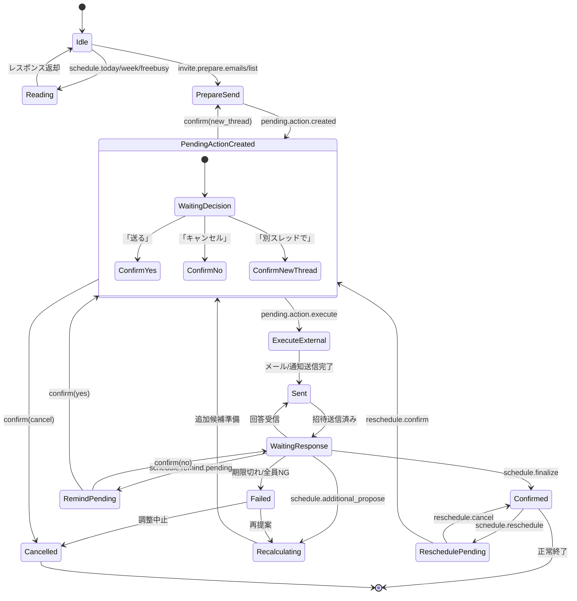
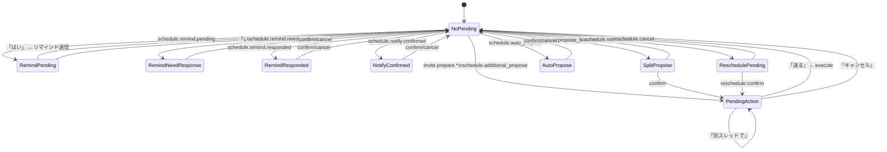

# AI会話化ロードマップ

> **目標**: 決め打ちインテント方式を壊さずに、AI秘書との自然会話で全機能を動かす
> 
> **原則**: AIは「解釈と計画」のみ、実行は「既存の堅いインテント/実行基盤」で行う

---

## 0. 本仕様書の位置づけ

- 本書は **画面仕様書ではない**
- 本書は **実装詳細書でもない**
- 本書は **「すべての予定調整機能の上位概念仕様」** である
- 既存実装は **下位レイヤー（Action Layer）として尊重**
- 本仕様は **上書きせず"包む"**

---

## 1. 解決したい本質的課題

### 1.1 人間の予定調整が抱える構造的問題

1. **相手ごとに調整方法が違う**
2. **人数が増えると指数的に面倒になる**
3. **暗黙ルール（この人とは午後等）が言語化されない**
4. **再調整が地獄**
5. **「誰かでいい」「全員必要」などの条件が曖昧**

### 1.2 本システムのゴール

```
「予定調整」という行為を
人が"考えるもの"から
AI秘書に"任せるもの"に変える
```

**ただし：**
- 勝手に決めない
- 勝手に動かない
- **確定した瞬間だけ実行**

---

## 2. 設計原則（絶対原則）

### 原則1：会話が一次情報
- UI操作は補助
- **会話ログがSSOT（Single Source of Truth）**

### 原則2：AIは判断者ではない
- AIは **分類・整理・提案** のみ
- **実行は確定インテントのみ**

### 原則3：予定調整は有限状態機械である
- 調整は必ず **開始 → 進行 → 確定 or 中断**
- **無限ループを許さない**

### 原則4：既存実装を壊さない
- 既存の `classifier → intent → apiExecutor/executors → pending.action` を **"実行レール"** として維持
- AIは **自然言語→(意図/パラメータ/計画)** を作るだけ

---

## 3. 予定調整のメタモデル（全体構造）

すべての予定調整は、以下 **7要素** で完全に表現できる。

### 3.1 調整メタモデル

| 要素 | 定義 | 例 |
|------|------|-----|
| **Initiator** | 調整を開始した人 | 主催者 |
| **Owner** | 調整の責任者 | 主催者（または代理人） |
| **Participants** | 参加が確定する人 | AND条件の全員 |
| **Candidate Pool** | 参加候補者の集合 | 招待対象リスト |
| **Participation Rule** | AND / OR / Vote | 全員参加 or 誰か1人 |
| **Visibility Rule** | 共有レベル | 空き時間のみ共有 |
| **Commit Rule** | 確定方法 | 手動承認 / 自動確定 |

**この7つが揃った時点で、AIは「どの調整か」を一意に特定できる**

---

## 4. 人数構造（Participation Topology）

### 4.1 基本分類（完全網羅）

| ID | 構造 | 説明 | 典型例 |
|----|------|------|--------|
| **T1** | 1 : 1 | 個別調整 | 1on1ミーティング |
| **T2** | 1 : N | 一斉案内（主催者→複数） | セミナー、説明会 |
| **T3** | N : 1 | 誰か1人割当 | 営業担当、サポート |
| **T4** | N : N | 複数人同士 | チームMTG |
| **T5** | G : N | グループ→個人 | チームから担当選出 |
| **T6** | N : G | 個人→グループ | 顧客→サポートチーム |

※ G = 定義済みグループ

### 4.2 人数構造と既存インテントの対応

| 構造 | 対応インテント | 備考 |
|------|----------------|------|
| 1:1 | `schedule.freebusy` | 自分の空き |
| 1:N | `invite.prepare.*` | 一斉招待 |
| N:1 | （将来）`schedule.assign` | 担当割当 |
| N:N | `schedule.freebusy.batch` | 共通空き |

---

## 5. 関係性レベル（Relationship & Permission）

### 5.1 関係性マトリクス

| レベル | 空き時間 | 予定内容 | 代理操作 | 調整方式 |
|--------|----------|----------|----------|----------|
| **他人** | × | × | × | 候補提示→選択 |
| **半共有** | ○ | × | × | 空き突合→提案 |
| **仕事仲間** | ○ | × | △ | 空き突合→自動提案 |
| **家族・完全信頼** | ○ | ○ | ○ | 即時挿入→通知のみ |

### 5.2 関係性とシステム動作

| 関係性 | Google連携 | 空き取得 | 予定挿入 |
|--------|------------|----------|----------|
| 他人 | 不要 | 不可 | 不可 |
| 半共有 | 任意 | freebusy API | 不可 |
| 仕事仲間 | 必要 | freebusy API | 承認後 |
| 家族 | 必要 | freebusy API | 即時可 |

---

## 6. 参加条件ルール（Participation Rule）

### 6.1 AND（全員参加必須）
- **積集合** で空きを算出
- 1人でもNGなら候補から除外
- 現状: `schedule.freebusy.batch` で実装済み

### 6.2 OR（誰か1人で成立）
- **和集合** で算出
- 割当ロジック必要（後述）
- 現状: 未実装（将来計画）

### 6.3 Vote（投票）
- 候補日提示 → 各人が可否入力
- 閾値条件で確定
- 現状: 既存の投票フロー

### 6.4 複合条件（高度）
- 例: `(A AND B) OR C`
- 現状: 未実装（将来計画）

---

## 7. 可視性ルール（Visibility Rule）

### 7.1 情報レベル

| レベル | 共有内容 | 用途 |
|--------|----------|------|
| **V0** | 候補日時のみ | 外部招待 |
| **V1** | 空き時間 | 社内調整 |
| **V2** | 予定タイトル | チーム共有 |
| **V3** | フル予定 | 秘書代行 |

### 7.2 現状の実装状況

- V0: `invite.prepare.*` で実装済み
- V1: `schedule.freebusy.batch` で実装済み
- V2, V3: 未実装（家族モードで将来計画）

---

## 8. 確定ルール（Commit Rule）

### 8.1 確定方式

| 方式 | 内容 | 対応インテント |
|------|------|----------------|
| **手動承認** | 全員確認後に確定 | `schedule.finalize` |
| **自動確定** | 条件成立時に自動確定 | `schedule.auto_propose.confirm` |
| **仮押さえ** | 仮登録→後承認 | 未実装 |
| **代理確定** | 秘書が代行 | 未実装（家族モード） |

---

## 9. 調整フロー（状態遷移）

### 9.1 状態遷移図（Mermaid）



### 9.2 PendingState 別の状態遷移図（実装準拠）



### 9.3 状態定義

| 状態 | 説明 | 対応インテント |
|------|------|----------------|
| Idle | 調整開始前 | - |
| Drafting | 条件入力中 | `thread.create` |
| Candidate Presented | 候補提示済み | `invite.prepare.*` |
| Waiting Response | 回答待ち | `schedule.status.check` |
| Recalculating | 再計算中 | `schedule.additional_propose` |
| Confirming | 確定確認中 | `schedule.finalize` |
| Committed | 確定済み | - |
| Failed | 失敗（成立せず） | - |
| Cancelled | キャンセル | `schedule.reschedule.cancel` |

### 9.4 無限防止ルール（重要）

| ルール | 値 | 超過時の動作 |
|--------|-----|-------------|
| 再計算回数上限 | 最大3回 | Failed → 主催者判断に委ねる |
| 回答期限 | 設定可能 | 期限切れ → リマインド or Failed |
| 無応答リマインド | 最大2回 | 超過 → Failed提案 |

---

## 10. ユーザー定義ルール（プリファレンス）

### 10.1 個人ルール（users.schedule_prefs_json）

```typescript
interface SchedulePrefs {
  // 時間帯の好み
  time_windows?: TimeWindowRule[];    // 好む時間帯
  avoid_windows?: TimeWindowRule[];   // 避けたい時間帯
  
  // 一般ルール
  min_notice_hours?: number;          // 最低通知時間（例: 24時間前）
  max_days_ahead?: number;            // 最大先読み日数（例: 14日）
  max_meetings_per_day?: number;      // 1日の上限会議数
  
  // タイムゾーン
  timezone?: string;
}
```

**現状**: P3-GEN1 で実装済み

### 10.2 グループルール（将来計画）

```typescript
interface GroupPrefs {
  group_id: string;
  
  // チーム共通ルール
  default_meeting_duration?: number;  // デフォルト会議時間
  preferred_days?: DayOfWeek[];       // 好む曜日
  avoid_days?: DayOfWeek[];           // 避ける曜日
  
  // 暗黙知の明文化
  rules?: Array<{
    description: string;              // "月曜午前は全体会議"
    constraint: ConstraintRule;
  }>;
}
```

**現状**: 未実装（将来計画）

### 10.3 優先順位（スコアリング）

1. **参加必須条件**（hard constraint）→ 満たさないものは除外
2. **個人制約**（soft constraint）→ スコア加減点
3. **グループ制約** → スコア加減点
4. **負荷分散** → 同点時の調整
5. **直近優先** → タイブレーカー

**現状**: P3-GEN1 の slotScorer で部分実装済み

---

## 11. 割当ロジック（N:1）

### 11.1 選定基準（優先順）

| 順位 | 基準 | 説明 |
|------|------|------|
| 1 | 空き | 該当時間が空いている人 |
| 2 | 優先度 | 設定された優先度順 |
| 3 | 負荷 | 今週の会議数が少ない人 |
| 4 | 直近履歴 | 最近担当していない人 |
| 5 | ランダム | 同点時のタイブレーカー |

**現状**: 未実装（将来計画）

---

## 12. 再調整・キャンセル・リスケ

### 12.1 再調整（Reschedule）

| 項目 | ルール |
|------|--------|
| トリガー | `schedule.reschedule` |
| 回数制限 | 最大2回（設定可能） |
| 超過時 | 調整破棄 or 主催者判断 |
| 通知 | 既存参加者全員に再調整通知 |

**現状**: P2-D3 で実装済み

### 12.2 キャンセル

| 権限者 | 可能な操作 |
|--------|-----------|
| 主催者 | 即時キャンセル |
| 参加者 | 参加辞退（調整は継続） |
| 代理人 | 設定時のみ可能 |

---

## 13. AIとインテントの役割分担

### 13.1 AIの責務

| 責務 | 説明 | 出力 |
|------|------|------|
| 会話理解 | 自然文を解釈 | 構造化された意図 |
| 条件補完 | 不足情報を質問 | clarifications |
| パターン特定 | 人数構造/関係性を判定 | メタモデル要素 |
| 確定インテント提示 | 既存intentに落とす | ActionPlan |

### 13.2 AIがやらないこと（禁止事項）

| 禁止事項 | 理由 |
|----------|------|
| 勝手な予定登録 | 確認なしの外部影響 |
| 暗黙決定 | ユーザーの意図確認が必要 |
| ルール破壊 | 既存の安全機構を迂回しない |
| 推測による補完 | 曖昧なら質問する |

---

## 14. インテント体系（最上位分類）

### 14.1 ライフサイクルインテント

| Intent | 構造 | フェーズ |
|--------|------|----------|
| `schedule.create` | 調整開始 | Drafting |
| `schedule.modify` | 条件変更 | Candidate Presented |
| `schedule.commit` | 確定 | Confirming → Committed |
| `schedule.cancel` | 中止 | → Cancelled |
| `schedule.reschedule` | 再調整 | Committed → Recalculating |

### 14.2 発話からの分類例

| 発話 | 人数構造 | Intent |
|------|----------|--------|
| 「来週Aさんと1on1」 | 1:1 | `schedule.freebusy` |
| 「セミナー組んで」 | 1:N | `invite.prepare.*` |
| 「誰か対応して」 | N:1 | （将来）`schedule.assign` |
| 「全員で」 | N:N AND | `schedule.freebusy.batch` |
| 「投票で決めて」 | N:N Vote | 既存投票フロー |

---

## 15. 既存インテント一覧（Intent Map）

### A. カレンダー閲覧/空き枠（Phase Next-3）

| Intent | 説明 | 確認要否 | 人数構造 |
|--------|------|----------|----------|
| `schedule.today` | 今日の予定 | 不要 | 1:0 |
| `schedule.week` | 今週の予定 | 不要 | 1:0 |
| `schedule.freebusy` | 自分の空き時間/空き枠 | 不要 | 1:1 |
| `schedule.freebusy.batch` | 複数参加者の共通空き | 不要 | N:N |

### B. 招待・候補送信（Beta A）

| Intent | 説明 | 確認要否 | 人数構造 |
|--------|------|----------|----------|
| `invite.prepare.emails` | メール貼り付け→送信準備 | **必要** | 1:N |
| `invite.prepare.list` | リスト指定→送信準備 | **必要** | 1:N |
| `pending.action.decide` | 送る/キャンセル/別スレッドで | 不要 | - |

### C. 自動調整・追加候補（Phase Next-5/6）

| Intent | 説明 | 確認要否 | 状態遷移 |
|--------|------|----------|----------|
| `schedule.auto_propose` | 自動調整提案 | **必要** | → Candidate Presented |
| `schedule.auto_propose.confirm` | 提案確定 | 不要 | → Committed |
| `schedule.auto_propose.cancel` | 提案キャンセル | 不要 | → Cancelled |
| `schedule.additional_propose` | 追加候補提案 | **必要** | → Recalculating |

### D. リマインド（Phase Next-6 / Phase2）

| Intent | 説明 | 確認要否 | 状態 |
|--------|------|----------|------|
| `schedule.remind.pending` | 未返信リマインド提案 | **必要** | Waiting Response |
| `schedule.remind.pending.confirm` | リマインド確定 | 不要 | - |
| `schedule.remind.pending.cancel` | リマインドキャンセル | 不要 | - |
| `schedule.need_response.list` | 再回答必要者リスト表示 | 不要 | - |
| `schedule.remind.need_response` | 再回答必要者にリマインド | **必要** | - |
| `schedule.remind.responded` | 回答済みにリマインド | **必要** | - |

### E. 確定・再調整（Phase2）

| Intent | 説明 | 確認要否 | 状態遷移 |
|--------|------|----------|----------|
| `schedule.finalize` | 確定 | **必要** | → Committed |
| `schedule.reschedule` | 確定後やり直し | **必要** | Committed → Recalculating |
| `schedule.status.check` | 状況確認 | 不要 | - |
| `schedule.invite.list` | 招待者一覧 | 不要 | - |

### F. リスト管理（Beta A）

| Intent | 説明 | 確認要否 |
|--------|------|----------|
| `list.create` | リスト作成 | 不要 |
| `list.list` | リスト一覧 | 不要 |
| `list.members` | リストメンバー表示 | 不要 |
| `list.add_member` | リストにメンバー追加 | 不要 |

### G. 好み設定（P3-PREF）

| Intent | 説明 | 確認要否 |
|--------|------|----------|
| `preference.set` | 好み設定 | 不要 |
| `preference.show` | 好み表示 | 不要 |
| `preference.clear` | 好みクリア | 不要 |

---

## 16. アーキテクチャ設計

### 追加するコンポーネント

```
┌─────────────────────────────────────────────────────────────┐
│                      ユーザー発話                            │
└─────────────────────────────────────────────────────────────┘
                              │
                              ▼
┌─────────────────────────────────────────────────────────────┐
│  A) nlRouter（Natural Language Router）                     │
│  - 入力: ユーザー発話 + 文脈（スレッド/pending/ログ）         │
│  - 出力: ActionPlan（構造化JSON）                           │
│  - メタモデル7要素を埋める                                   │
│  - 失敗時: 既存ルール分類にフォールバック                    │
└─────────────────────────────────────────────────────────────┘
                              │
                              ▼
┌─────────────────────────────────────────────────────────────┐
│  B) policyGate（安全ゲート）                                │
│  - intentごとに「確認が必要か」判定                         │
│  - 状態遷移の妥当性チェック                                 │
│  - データ不足や危険操作をブロック → 質問に分解              │
└─────────────────────────────────────────────────────────────┘
                              │
                              ▼
┌─────────────────────────────────────────────────────────────┐
│  C) executorBridge                                          │
│  - ActionPlan.intent を IntentResult に変換                 │
│  - 既存の executeIntent() に投げる                          │
└─────────────────────────────────────────────────────────────┘
                              │
                              ▼
┌─────────────────────────────────────────────────────────────┐
│  既存: apiExecutor → executors → pending.action             │
│  （変更なし）                                               │
└─────────────────────────────────────────────────────────────┘
```

### ActionPlan スキーマ（拡張版）

```typescript
interface ActionPlan {
  // 既存インテントに落とす
  intent: IntentType;
  
  // パラメータ
  params: {
    range?: 'today' | 'week' | 'next_week';
    prefer?: 'morning' | 'afternoon' | 'evening' | 'business';
    duration_minutes?: number;
    threadId?: string;
    participants?: ParticipantInfo[];
  };
  
  // メタモデル要素（新規）
  meta?: {
    topology?: 'T1' | 'T2' | 'T3' | 'T4' | 'T5' | 'T6';  // 人数構造
    participation_rule?: 'AND' | 'OR' | 'VOTE';
    visibility_level?: 'V0' | 'V1' | 'V2' | 'V3';
    commit_rule?: 'manual' | 'auto' | 'tentative' | 'proxy';
  };
  
  // P3-GEN1: 好み（スコアリング用）
  preferences?: SchedulePrefs;
  
  // 確認が必要か（policyGateで上書き可能）
  requires_confirm: boolean;
  
  // 不足情報の質問
  clarifications?: Array<{
    field: string;
    question: string;
  }>;
  
  // 応答スタイル
  response_style: 'brief' | 'detailed' | 'conversational';
  
  // 次のアクション提案（Phase CONV-2）
  suggested_next_actions?: Array<{
    label: string;
    intent: IntentType;
    params: Record<string, any>;
  }>;
}
```

---

## 17. 安全ポリシー（Confirm Rules）

### 必ず確認が必要な操作

| カテゴリ | Intent | 理由 | 状態遷移 |
|----------|--------|------|----------|
| 外部送信 | `invite.prepare.*`, `schedule.remind.*` | メール/通知が飛ぶ | → Candidate Presented |
| 確定操作 | `schedule.finalize`, `schedule.auto_propose.confirm` | 取り消し困難 | → Committed |
| 再調整 | `schedule.reschedule` | 既存参加者への影響 | → Recalculating |

### 確認不要（安全）な操作

| カテゴリ | Intent | 理由 |
|----------|--------|------|
| 閲覧系 | `schedule.today`, `schedule.week`, `schedule.freebusy` | 副作用なし |
| リスト管理 | `list.*` | 内部データのみ |
| キャンセル系 | `*.cancel` | 送信を止める方向 |

---

## 18. フォールバック設計

### unknown時の質問テンプレート

```typescript
const FALLBACK_QUESTIONS: Record<string, string> = {
  missing_thread: '対象のスレッドを選択してください',
  missing_range: '期間を教えてください（例: 今週、来週）',
  missing_participants: '参加者を教えてください（メールアドレスまたはリスト名）',
  missing_topology: '参加者は「全員」ですか？それとも「誰か1人」でいいですか？',
  ambiguous_action: '何をしたいですか？\n- 空き時間を確認\n- 招待を送る\n- リマインドを送る',
};
```

### AI失敗時のフォールバック

```typescript
async function classifyWithFallback(input: string, context: IntentContext): Promise<IntentResult> {
  try {
    const aiResult = await nlRouter.classify(input, context);
    if (aiResult.confidence > 0.7) {
      return aiResult;
    }
  } catch (e) {
    console.warn('[nlRouter] Failed, falling back to rules', e);
  }
  
  // ルール分類にフォールバック
  return runRuleClassifiers(input, context);
}
```

---

## 19. ログ/監査（Incident対応）

### 保存すべきデータ

```typescript
interface NlRouterLog {
  id: string;
  timestamp: string;
  user_id: string;
  
  // 入力
  user_message: string;
  context: NlRouterInput['context'];
  
  // AI出力
  ai_response_raw: string;
  action_plan: ActionPlan | null;
  validation_errors?: string[];
  
  // メタモデル判定結果
  detected_topology?: string;
  detected_participation_rule?: string;
  
  // 実行結果
  final_intent: IntentType;
  executed: boolean;
  execution_result?: string;
  
  // 状態遷移
  state_before?: string;
  state_after?: string;
}
```

---

## 20. Intent Catalog（nlRouter許可リスト）

> **参照**: [`docs/intent_catalog.json`](./intent_catalog.json)

Intent Catalog は nlRouter が「勝手に知らないことを実行しない」ための許可リストです。
全 40+ のインテントについて、以下の情報を定義しています：

| フィールド | 説明 |
|-----------|------|
| `intent` | インテント名 |
| `category` | カテゴリ分類（calendar.read, invite.prepare, etc.） |
| `side_effect` | 副作用タイプ（none/read/write_local/write_external） |
| `requires_confirmation` | 確認が必要か |
| `topology` | 人数構造（1:1, 1:N, N:N, etc.） |
| `params_schema` | パラメータスキーマ |
| `executor` | 実行ファイル |
| `api` | 対応API |

### 副作用タイプ分類

| タイプ | 説明 | 例 |
|--------|------|-----|
| `none` | 副作用なし | キャンセル系 |
| `read` | 参照のみ（安全） | schedule.today, schedule.freebusy |
| `write_local` | DB更新（外部送信なし） | invite.prepare.*, preference.set |
| `write_external` | 外部送信（必ず確認） | remind.*.confirm, pending.action.execute |

---

## 21. P3-SCORE1 設計仕様（理由表示）

### 21.1 目的

スコアリングされた候補に対して「なぜこの枠が上位なのか」を
ユーザー名付きで表示し、AI秘書としての説明力を向上させる。

### 21.2 ScoreReason 構造（実装済み）

```typescript
// apps/api/src/utils/schedulePrefs.ts

interface ScoreReason {
  source: string;          // ユーザーID または 'proximity'
  label: string;           // 理由のラベル（例: '午後希望', '木曜夜希望'）
  delta: number;           // スコアへの影響（正/負）
}

interface ScoredSlot {
  start_at: string;        // ISO 8601
  end_at: string;          // ISO 8601
  label: string;           // 表示用ラベル
  score: number;           // 合計スコア
  reasons: ScoreReason[];  // スコアの理由一覧
}
```

### 21.3 スコアリングルール

| ルール種別 | スコア影響 | 例 |
|-----------|-----------|-----|
| `time_windows` マッチ | + weight | 「午後14:00-18:00」に合致 → +10 |
| `avoid_windows` マッチ | - weight | 「月曜朝」に該当 → -12 |
| 直近優先（タイブレーカー） | -0.001 × hours | 1時間後 → -0.001 |

### 21.4 理由表示フォーマット（P3-SCORE1 ToDo）

**表示例（目標）:**
```
1. 1/27(月) 14:00-15:00  [score: 42]
   - Aさん: 午後(14:00-18:00)に合致 (+10)
   - Bさん: 木曜夜希望に近い (+6)

2. 1/28(火) 10:00-11:00  [score: 28]
   - Aさん: 午後希望に合わない (-3)
   - Bさん: 特に制約なし (0)
```

### 21.5 圧縮ルール（実装予定）

1. **参加者で合算**: 同一 participant + 同一 rule は delta を合算
2. **上位3件のみ**: 理由が多い場合は |delta| が大きい順に3件
3. **タイブレーカー非表示**: proximity は通常非表示（デバッグ時のみ）

### 21.6 実装ToDo

| 対象 | ファイル | 内容 |
|------|----------|------|
| Backend | `slotScorer.ts` | `formatReasonsWithUsers()` 実装済み |
| Backend | `schedulePrefs.ts` | `rule.label` 自動生成（未） |
| Frontend | `calendar.ts` | `ScoreReason` 型定義済み |
| Frontend | `executors/calendar.ts` | 理由の整形表示（強化予定） |
| E2E | `calendar.spec.ts` | 理由表示テスト追加予定 |

---

## 22. 段階的ロードマップ

### Phase CONV-0: AIを「好み抽出」にだけ使う（✅ 完了）

**状態**: P3-GEN1 完了
- `SchedulePrefs` スキーマ定義済み
- `slotScorer.ts` でスコアリング実装済み
- `scored_slots` をAPIで返却
- フロント表示対応済み

**成果**:
- "好みっぽい文言" → 構造化 → スコア反映
- 既存インテントは温存

### Phase CONV-1: AIが「解釈補助」になる（✅ 実装完了）

**実装内容**:
- 現状の classifier はそのまま
- **classifier が `unknown` になった時だけ** nlRouter を呼ぶ
- nlRouter が既知の intent に落とせたら実行、落とせなければ質問

**成果**:
- "決め打ち文言じゃないと動かない" が一気に緩和
- 事故は増えない（confirmは既存のまま）

**実装ファイル**:

**Backend（calendar限定 /api/nl/route）**:

| ファイル | 概要 |
|---------|------|
| `apps/api/src/routes/nlRouter.ts` | /api/nl/route エンドポイント（LLM呼び出し） |
| `apps/api/src/utils/nlRouterSchema.ts` | Zodスキーマ（IntentEnum, RangeEnum, DayTimeEnum） |
| `apps/api/src/utils/nlRouterPrompt.ts` | システムプロンプト全文 |

**Frontend（nlRouter モジュール）**:

| ファイル | 概要 |
|---------|------|
| `nlRouter/types.ts` | Zod スキーマ + ActionPlan/NlRouterOutput 型定義 |
| `nlRouter/systemPrompt.ts` | AI システムプロンプト生成 |
| `nlRouter/nlRouter.ts` | AI呼び出し本体（OpenAI互換） |
| `nlRouter/policyGate.ts` | 安全ゲート（write_external必ず確認、pending中制限） |
| `nlRouter/executorBridge.ts` | ActionPlan→IntentResult変換、既存実行への橋渡し |
| `nlRouter/index.ts` | 統合エントリポイント |

**Frontend（統合）**:

| ファイル | 概要 |
|---------|------|
| `core/api/nlRouter.ts` | Backend /api/nl/route APIクライアント |
| `core/chat/apiExecutor.ts` | unknown時のAIフォールバック統合 |
| `core/chat/classifier/index.ts` | unknown時にrawInputをparamsに含める |

**使い方**:
```typescript
import { route, classifyWithAiFallback, createContext, createInput } from './nlRouter';

// 方法1: 直接 AI を呼ぶ場合
const context = createContext({ selectedThreadId });
const input = createInput(userMessage, context);
const output = await route(input, { apiKey: 'YOUR_API_KEY' });

// 方法2: ルールベース + AI フォールバックの統合フロー
const result = await classifyWithAiFallback({
  input: userMessage,
  context,
  ruleResult: classifyIntent(userMessage, intentContext),
  aiEnabled: true,
  aiOptions: { apiKey: 'YOUR_API_KEY' }
});
// result.source = 'rule' | 'ai' | 'fallback'
```

**安全ポリシー（policyGate）**:
- `.confirm` 系 intent は AI が直接返すことを禁止
- `write_external` 系は AI が直接返すことを禁止（確認フロー経由必須）
- pending 中は `pending.action.decide`, `schedule.today/week/freebusy` 等のみ許可
- 確認必須 intent は `requires_confirm` を強制 true

### Phase CONV-2: AIが「会話の主導権」を持つ

**実装内容**:
- すべての入力を nlRouter に通す
- 既知intentはそのまま実行レールへ
- 不明は質問
- pending中は、AIが "次に何をすべきか" を自然言語で導く

### Phase CONV-3: 複合タスクの実行

**実装内容**:
- 1回の会話で複数intentを段階実行
- 状態遷移の管理
- 例：「来週の午後で、A/B/Cに送って」
  - → `freebusy.batch` → `score` → `prepareSend` → `pending.action.created`

### Phase CONV-4: 高度な人数構造対応（将来）

**実装内容**:
- N:1（誰か1人割当）の実装
- 複合条件（(A AND B) OR C）
- グループルールの実装

---

## 23. 網羅性チェック（最終）

| 項目 | 状態 | 備考 |
|------|------|------|
| 人数構造（6種） | ✅ 定義済み | T3-T6は将来実装 |
| 関係性（4段階） | ✅ 定義済み | 家族モードは将来 |
| 参加条件（AND/OR/Vote/複合） | ✅ 定義済み | OR/複合は将来 |
| 状態遷移図（Mermaid） | ✅ 追加済み | 9.1, 9.2 |
| 無限防止ルール | ✅ 定義済み | 回数制限 |
| 割当ロジック | ✅ 定義済み | 将来実装 |
| 再調整/キャンセル | ✅ 実装済み | P2-D3 |
| 通知チャネル | ✅ 実装済み | Email/Slack/Chatwork |
| Intent Catalog JSON | ✅ 追加済み | docs/intent_catalog.json |
| P3-SCORE1 設計 | ✅ 追加済み | §21 |
| 既存実装非破壊 | ✅ 原則遵守 | - |

---

## 24. 次のアクション

### 直近（CONV-1 実装フェーズ）

1. ✅ **P3-SCORE1（理由表示）実装**: `rule.label` 自動生成、executors表示強化
2. ✅ **Phase CONV-1 設計**: nlRouter のプロンプト設計、Zodスキーマ定義
3. **AI サービス接続**: 実際の LLM API（OpenAI/Claude/Azure）との接続実装

### 中期

4. **Phase CONV-1 統合テスト**: unknown時のAIフォールバック動作確認
4. **好み設定UI**: チャットから好みを設定できる `preference.set` の自然言語対応
5. **状態遷移の可視化**: 調整フローの進捗表示（UIコンポーネント）

### 将来

6. **N:1割当ロジック**: 担当者自動選出
7. **グループルール**: チーム共通の暗黙知明文化
8. **家族モード**: 即時挿入機能

---

## 付録: 関連ドキュメント

| ドキュメント | 概要 |
|-------------|------|
| [`docs/intent_catalog.json`](./intent_catalog.json) | Intent完全定義（nlRouter許可リスト） |
| `apps/api/src/utils/schedulePrefs.ts` | SchedulePrefs 型定義 |
| `apps/api/src/utils/slotScorer.ts` | スコアリングロジック |
| `frontend/src/core/chat/classifier/types.ts` | IntentType 定義 |
| `frontend/src/core/chat/pendingTypes.ts` | PendingState 定義 |
| `frontend/src/core/chat/nlRouter/` | CONV-1 AI フォールバック設計 |

---

## 25. CONV-1 設計詳細（nlRouter）

### 25.1 コンポーネント構成

```
frontend/src/core/chat/nlRouter/
├── types.ts          # Zod スキーマ + 型定義
├── systemPrompt.ts   # AI システムプロンプト
├── policyGate.ts     # 安全ゲート
├── executorBridge.ts # 既存実行への橋渡し
└── index.ts          # 統合エントリポイント
```

### 25.2 データフロー

```
ユーザー入力
    │
    ▼
┌─────────────────────────────────────────┐
│  classifyIntentChain()                   │
│  （既存ルール分類）                        │
└─────────────────────────────────────────┘
    │
    │ intent === 'unknown' の場合のみ
    ▼
┌─────────────────────────────────────────┐
│  classifyWithFallback()                  │
│  （AI フォールバック）                    │
│                                          │
│  1. nlRouter.classify() → ActionPlan    │
│  2. policyGate.evaluate() → 検証        │
│  3. executorBridge.convert() → IntentResult │
└─────────────────────────────────────────┘
    │
    ▼
┌─────────────────────────────────────────┐
│  既存の executeIntent()                  │
│  （apiExecutor / executors）             │
└─────────────────────────────────────────┘
```

### 25.3 ActionPlan スキーマ

```typescript
interface ActionPlan {
  intent: IntentType;           // 既存の intent に落とす
  params: {                     // Intent 別のパラメータ
    range?: 'today' | 'week' | 'next_week';
    prefer?: 'morning' | 'afternoon' | 'evening' | 'business';
    duration_minutes?: number;
    threadId?: string;
    participants?: ParticipantInfo[];
    // ...
  };
  meta?: {                      // メタモデル要素
    topology?: 'T1' | 'T2' | 'T3' | 'T4' | 'T5' | 'T6';
    participation_rule?: 'AND' | 'OR' | 'VOTE';
    visibility_level?: 'V0' | 'V1' | 'V2' | 'V3';
    commit_rule?: 'manual' | 'auto' | 'tentative' | 'proxy';
  };
  requires_confirm: boolean;    // 確認が必要か
  clarifications?: Array<{      // 不足情報の質問
    field: string;
    question: string;
  }>;
  confidence: number;           // AI の信頼度 (0.0-1.0)
  message?: string;             // ユーザーへの返答
}
```

### 25.4 policyGate ルール

| チェック項目 | 内容 | ブロック時のアクション |
|-------------|------|----------------------|
| 許可リスト | intent が許可リストにあるか | エラー返却 |
| スレッド必須 | 一部 intent は threadId 必須 | 質問を返す |
| pending 必須 | pending.action.decide 等 | 質問を返す |
| 必須パラメータ | intent 別の必須項目 | 質問を返す |
| 信頼度閾値 | confidence < 0.5 | 質問を返す |
| clarifications | 不足情報がある | 質問を返す |

### 25.5 使用方法

```typescript
import { classifyWithFallback, configureNlRouter } from './nlRouter';

// アプリ起動時に設定
configureNlRouter({
  enabled: true,
  endpoint: process.env.AI_SERVICE_ENDPOINT,
});

// 分類時（既存の classifyIntent の代わりに）
const result = await classifyWithFallback(userInput, context);
```

### 25.6 実装 TODO

| 優先度 | タスク | 状態 |
|--------|--------|------|
| 高 | Zod スキーマ定義 | ✅ 完了 |
| 高 | システムプロンプト設計 | ✅ 完了 |
| 高 | policyGate 実装 | ✅ 完了 |
| 高 | executorBridge 実装 | ✅ 完了 |
| 高 | 統合エントリポイント | ✅ 完了 |
| 高 | Backend /api/nl/route | ✅ 完了 |
| 高 | Frontend APIクライアント | ✅ 完了 |
| 高 | apiExecutor フォールバック統合 | ✅ 完了 |
| 中 | E2E テスト（calendar.spec.ts） | ✅ 完了 |
| 中 | AI サービス接続（本番APIキー設定） | 手動確認待ち |
| 低 | 監査ログ保存 | 未着手 |

---

## 26. CONV-1.0（calendar限定）実装完了 ✅

### 26.1 実装概要

- **unknown intent の場合のみ** NL Router にフォールバック
- **calendar系のみ許可**（read-only: schedule.today/week/freebusy/freebusy.batch）
- **write系は対象外**（invite/send/finalize/remind は NL Router から返さない）
- threadId が必要な場合は `needs_clarification` を返す

### 26.2 バックエンド実装

| ファイル | 概要 |
|---------|------|
| `apps/api/src/routes/nlRouter.ts` | /api/nl/route エンドポイント |
| `apps/api/src/utils/nlRouterSchema.ts` | Zod スキーマ（IntentEnum, RangeEnum, DayTimeEnum, RouteResultSchema） |
| `apps/api/src/utils/nlRouterPrompt.ts` | システムプロンプト（buildNlRouterSystemPrompt, buildNlRouterUserPrompt） |

**API仕様（/api/nl/route）**:
```typescript
// Request
{ text: string; context: { selected_thread_id?: string; viewer_timezone: string } }

// Response（成功）
{ intent: 'schedule.freebusy'; confidence: 0.82; params: { range: 'next_week', dayTimeWindow: 'afternoon', durationMinutes: 60 }; rationale: '来週+午後+' }

// Response（要確認）
{ intent: 'schedule.freebusy.batch'; confidence: 0.78; needs_clarification: { field: 'threadId', message: 'どのスレッド...' } }

// Response（不明）
{ intent: 'unknown'; confidence: 0.2; params: {} }
```

### 26.3 フロントエンド実装

| ファイル | 概要 |
|---------|------|
| `frontend/src/core/api/nlRouter.ts` | Backend APIクライアント |
| `frontend/src/core/chat/apiExecutor.ts` | unknown時のフォールバック統合（executeUnknownWithNlRouter） |
| `frontend/src/core/chat/classifier/index.ts` | unknown時に rawInput を params に含める |

### 26.4 E2Eテスト

| ファイル | テストケース |
|---------|------------|
| `frontend/e2e/calendar.spec.ts` | CONV-1.0: 自然文→unknown→nlRouter→freebusy フォールバック |
| | CONV-1.0: 口語的な空き確認にも対応 |

### 26.5 安全ポリシー

- `.confirm` 系 intent は AI が直接返すことを禁止
- `write_external` 系（invite/send/finalize/remind）は AI が直接返すことを禁止
- pending 中は `pending.action.decide`, `schedule.today/week/freebusy` 等のみ許可
- 確認必須 intent は `requires_confirm` を強制 true

### 26.6 次のステップ

| 優先度 | タスク | 状態 |
|--------|--------|------|
| 高 | 本番環境でAPIキー設定＋手動確認 | 手動確認待ち |
| 中 | preference.set の自然言語対応（CONV-1.1） | 未着手 |
| 中 | propose 系の AI サポート（CONV-1.2） | 未着手 |
| 低 | 監査ログ保存 | 未着手 |

---

*最終更新: 2026-01-24*
