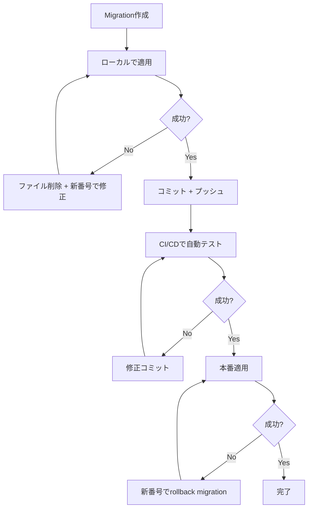

# Migration運用チェックリスト (P0-3)

## ✅ 運用ルール（絶対厳守）

### 1. Migration番号は増やすだけ
- ❌ **NG**: 過去のmigrationファイルを編集/削除/リネーム
- ✅ **OK**: 新しい番号のmigrationで修正
- 例: `0052_create_list_members.sql` に誤りがあった場合
  - ❌ **NG**: `0052_create_list_members.sql` を直接編集
  - ✅ **OK**: `0060_fix_list_members.sql` を作成

### 2. Migration失敗時の対応
- **ローカルで失敗**: 
  1. `npm run db:reset:local` でDBをリセット
  2. 誤ったmigrationファイルを削除（ローカルのみ）
  3. 正しいmigrationを新番号で作成
  4. `npm run db:migrate:local` で再実行

- **本番で失敗**:
  1. **絶対にファイルを削除しない**
  2. 新しい番号のmigrationで修正
  3. 例: `0061_rollback_list_members.sql` で `DROP TABLE list_members;` を実行
  4. 例: `0062_create_list_members_fixed.sql` で正しいテーブルを作成

### 3. 番号の採番ルール
- **4桁ゼロパディング**: `0001`, `0002`, ..., `0100`
- **連番**: 欠番なし、飛ばしなし
- **確認方法**: `ls -1 db/migrations/ | tail -5`

### 4. Migration作成時のチェック
- [ ] PRAGMA foreign_keys = ON; を先頭に記載
- [ ] DROP TABLE IF EXISTS (開発時のみ、本番では慎重に)
- [ ] CREATE TABLE に NOT NULL / DEFAULT を適切に設定
- [ ] INDEX を必ず作成（特に WHERE / ORDER BY に使うカラム）
- [ ] UNIQUE INDEX で重複防止
- [ ] テーブル名は複数形（例: `lists`, `list_members`）
- [ ] カラム名は snake_case（例: `owner_user_id`, `added_at`）
- [ ] 日時カラムは TEXT 型で datetime('now')

### 5. CI/CD での自動チェック
```bash
# .github/workflows/db-migration-check.yml
- name: Check migration順序
  run: |
    cd db/migrations
    prev=""
    for f in $(ls -1 *.sql); do
      if [[ "$prev" > "$f" ]]; then
        echo "Migration順序エラー: $prev > $f"
        exit 1
      fi
      prev="$f"
    done

- name: Apply migrations (local)
  run: npm run db:migrate:local
```

---

## 🔴 緊急時の対応

### ケース1: 重複番号が発生した
```bash
# 現状確認
ls -1 db/migrations/005* 

# 出力例:
# 0053_add_contact_id.sql
# 0053_create_contact_channels.sql  ← 重複

# 対応:
mv db/migrations/0053_create_contact_channels.sql \
   db/migrations/0060_create_contact_channels.sql
```

### ケース2: 本番でmigrationが失敗した
```bash
# 1. 本番の状態確認
npx wrangler d1 migrations list webapp-production

# 2. 失敗したmigrationを特定（例: 0055が失敗）
# 3. 新しいmigrationで修正
cat > db/migrations/0061_rollback_0055.sql <<EOF
PRAGMA foreign_keys = ON;
DROP TABLE IF EXISTS ledger_audit_events;
EOF

# 4. 正しいmigrationを作成
cat > db/migrations/0062_create_ledger_audit_events_fixed.sql <<EOF
...
EOF

# 5. 本番適用
npx wrangler d1 migrations apply webapp-production
```

---

## 📊 Migration履歴の確認

### ローカル
```bash
npx wrangler d1 migrations list webapp-production --local
```

### 本番
```bash
npx wrangler d1 migrations list webapp-production
```

---

## 🚨 やってはいけないこと

1. ❌ 本番適用済みのmigrationファイルを編集
2. ❌ 本番適用済みのmigrationファイルを削除
3. ❌ migration番号を飛ばす（0050 → 0052）
4. ❌ migration番号をリネーム（0052 → 0060）
5. ❌ 本番でDROP TABLEを気軽に実行
6. ❌ ローカルとリモートでmigration履歴が異なる状態を放置

---

## ✅ 正しい運用フロー



---

## 📝 参考コマンド

```bash
# ローカルDBリセット
npm run db:reset:local

# ローカルでmigration適用
npm run db:migrate:local

# 本番でmigration適用
npm run db:migrate:prod

# Migration履歴確認（ローカル）
npx wrangler d1 migrations list webapp-production --local

# Migration履歴確認（本番）
npx wrangler d1 migrations list webapp-production

# テーブル一覧確認
npx wrangler d1 execute webapp-production --local \
  --command="SELECT name FROM sqlite_master WHERE type='table'"

# テーブル構造確認
npx wrangler d1 execute webapp-production --local \
  --command="PRAGMA table_info(list_members)"
```
